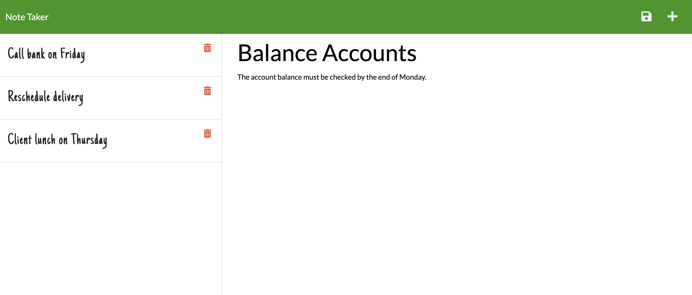

# Note Taker
An application to write and save note with Express.js back end and will save and retrieve note data from JSON file.

### Github : https://github.com/alsornak/Note-Taker

### Deployed app : <a href="https://pure-anchorage-33232.herokuapp.com/" target = "_blank">Heroku Link</a>


## Description
An application to write and save note with Express.js back end and will save and retrieve note data from JSON file.

## User Story
```
- AS A small business owner
- I WANT to be able to write and save notes
- SO THAT I can organize my thoughts and keep track of tasks I need to complete
```


## Usage
- Application will allow user to be able to add note's title and description
- Application will allow user to be able to save the notes and won't lose them even they refresh the page
- Application will allow user to be delete notes


## Screenshots

### Get Started:


### Adding Notes:


### Saving the Notes:



## Technologies Use
<p><a href="https://nodejs.org/" target = "_blank">Node.js</a></p>
<p><a href="https://www.npmjs.com/" target = "_blank">NPM</a></p>
<p><a href="https://www.npmjs.com/package/express" target = "_blank">Express.js</a></p>
<p><a href="https://www.npmjs.com/package/inquirer" target = "_blank">Inquirer.js</a></p>
<p><a href="https://getbootstrap.com/" target = "_blank">Bootstrap</a></p>
<p><a href="https://fonts.google.com/" target = "_blank">Google Fonts</a></p>


## Contributor
Sorna Kesavan ©2022 All Rights Reserved.
- - -
